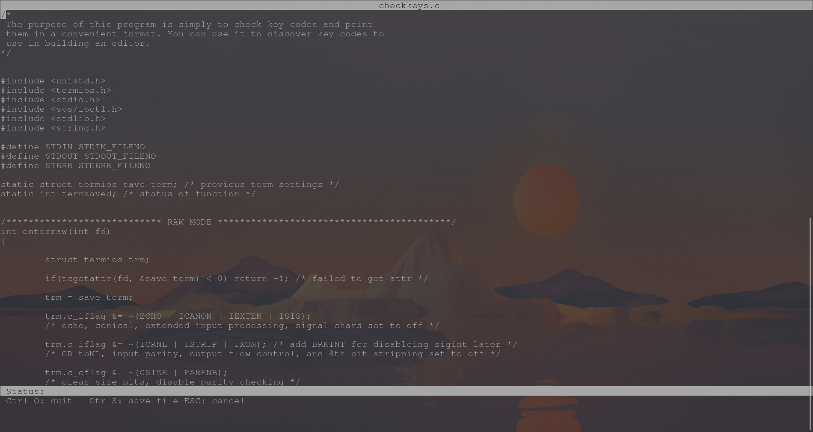

# JET
Lightly featured text editor written in C borrows from antirez's Kilo text editor for buffering the screen. Antirez's excellent guide and source code can be found at https://github.com/antirez/kilo

## Usage
- `jet <filename>` will open a file in the editor. Providing the file name is optional, a blank will be opened if none is provided.
### Controls
- `Ctrl+S` will save the currently opened file in the current dir. If it is a new file you will be prompted to provide a name.
- `Esc` can be used to cancel the file name prompt to avoid saving the file.
- `Ctrl+Q` will exit the editor. Ensure you have saved your file before doing so.
### Navigation
- Arrow keys move up, down, left, right
- backspace deletes the character behind the cursor
- the home key moves to the beginning of the line
- the end key moves to the end of the line

## Installation
To install `jet` simply clone the repo and run `sudo make install` in the repo root. This place the `jet` binary in your `/usr/local/bin`.
If you would like to place the binary elsewhere you can run `make` in the repo root and move the binary labled `jet` to your prefered location.

